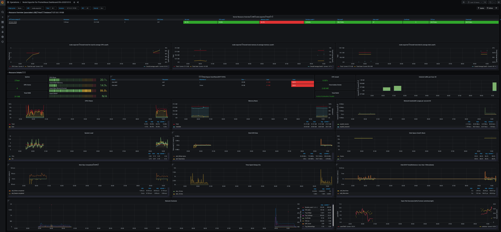

# Sample File

This is a sample file to validate auto-generation capabilities:

## Capabilities

List of features:

- markdown to many formats with [pandoc](https://pandoc.org/)
- [plantuml](https://plantuml.com/) support for diagramming
 

### An inline plantuml

Below is inline plantuml 

```plantuml
Bob -> Alice : hello
Alice -> Bob : hi
```

### Table

A sweet table:

| col | col | col |
| --- | --- | --- |
| row | row | row |
| row | row | row |
| row | row | row |
| row | row | row |

### Images

Some images

